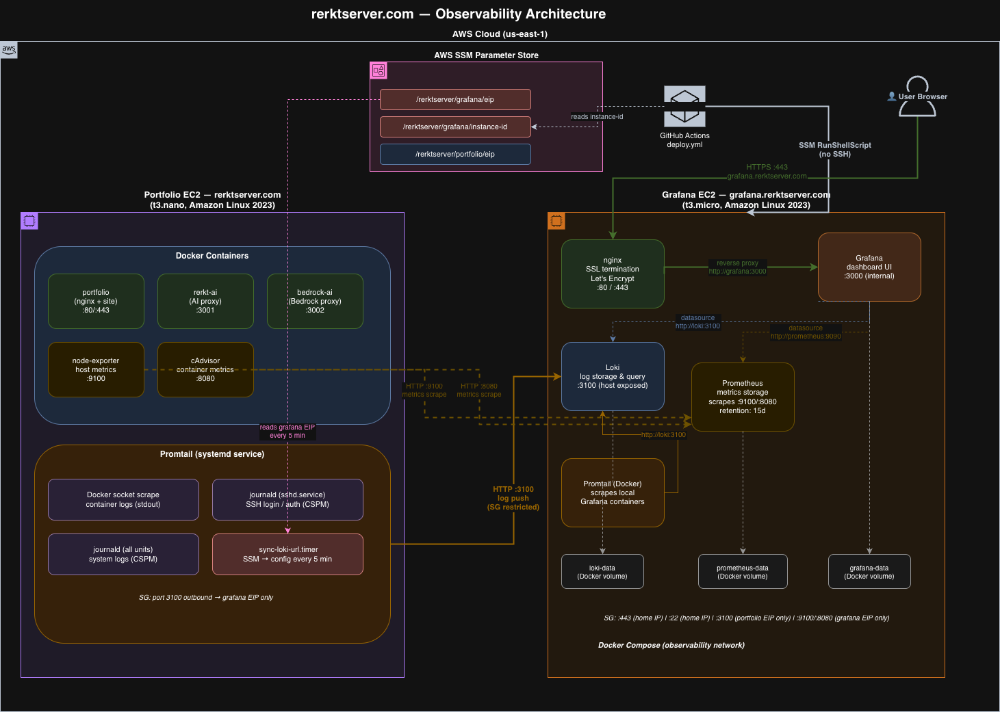

# aws-grafana — Observability Stack

Dedicated EC2 instance running Grafana, Loki, and Promtail for centralized log observability across the rerktserver.com infrastructure.

---

## What This Does

Collects and visualizes logs from all containers running on the portfolio EC2 (rerktserver.com) — nginx access logs, AI proxy logs, and system/auth logs — in a single Grafana dashboard at [grafana.rerktserver.com](https://grafana.rerktserver.com).

---

## Architecture



> Source: [architecture.drawio](architecture.drawio) — open with [draw.io](https://app.diagrams.net)

```
portfolio EC2 (rerktserver.com)
  └── Promtail (systemd service)
        ├── Docker socket  → portfolio, rerkt-ai, bedrock-ai container logs
        ├── journald (sshd.service) → SSH login / auth events (CSPM)
        └── journald (all units)    → system logs
              │
              │ HTTP :3100 (Security Group whitelist: portfolio EIP only)
              ▼
Grafana EC2 (grafana.rerktserver.com)
  └── Docker Compose
        ├── Loki       → log storage and query engine
        ├── Promtail   → scrapes local Grafana EC2 container logs only
        ├── Prometheus → metrics scraping (node-exporter :9100, cAdvisor :8080)
        ├── Grafana    → visualization UI (port 3000, behind nginx)
        └── nginx      → SSL termination, reverse proxy (ports 80/443)

portfolio EC2 (rerktserver.com)
  ├── node-exporter  :9100 → host metrics (CPU, memory, disk, network)
  └── cAdvisor       :8080 → per-container metrics
              │
              │ HTTP :9100/:8080 (Security Group whitelist: grafana EIP only)
              ▼
        Prometheus (on Grafana EC2)

SSM Parameter Store
  ├── /rerktserver/grafana/eip      → read by aws-server promtail sync timer
  ├── /rerktserver/grafana/instance-id → read by GitHub Actions deploy
  └── /rerktserver/portfolio/eip    → read by aws-grafana prometheus at deploy
```

---

## Components

| Component | Image | Purpose |
|-----------|-------|---------|
| Grafana | `grafana/grafana:10.2.0` | Dashboard and alerting UI |
| Loki | `grafana/loki:2.9.0` | Log aggregation and storage |
| Promtail | `grafana/promtail:2.9.0` | Log collector (Grafana EC2 containers) |
| nginx | `nginx:1.27-alpine` | SSL termination via Let's Encrypt |

---

## Infrastructure

All infrastructure is managed by Terraform in `terraform/`.

| Resource | Description |
|----------|-------------|
| VPC + public subnet | Isolated network for Grafana EC2 |
| EC2 (t3.micro) | Hosts the Docker Compose stack |
| Elastic IP | Static public IP — DNS never needs updating |
| Security Group | Port 443 (home IP), 22 (home IP), 3100 (portfolio EIP only) |
| IAM Role | `AmazonSSMManagedInstanceCore` — SSM deploy, no SSH in CI/CD |
| Route53 A record | `grafana.rerktserver.com` → Elastic IP |
| SSM Parameter Store | `/rerktserver/grafana/eip` and `/rerktserver/grafana/instance-id` |

---

## SSM Parameter Store Integration

Terraform writes two parameters to AWS SSM on every `apply`:

- `/rerktserver/grafana/eip` — Grafana Elastic IP (read by aws-server Promtail sync timer every 5 min)
- `/rerktserver/grafana/instance-id` — EC2 instance ID (read by GitHub Actions deploy workflow)

Terraform reads one parameter from SSM:

- `/rerktserver/portfolio/eip` — Portfolio Elastic IP (used to lock Loki port 3100 in the security group)

No hardcoded IPs or instance IDs anywhere. Destroy and recreate the stack — everything updates automatically.

---

## Deployment

### First-time setup (deploy order matters)

1. Deploy `aws-server` first — stores portfolio EIP in SSM
2. Deploy `aws-grafana` — reads portfolio EIP from SSM for security group

```bash
# In aws-server/terraform
terraform init && terraform apply

# In aws-grafana/terraform
terraform init && terraform apply
```

### Application deploy

Push to `main` — GitHub Actions deploys via SSM (no SSH, no static credentials):

```bash
git push origin main
```

The workflow:
1. Reads instance ID from SSM (`/rerktserver/grafana/instance-id`)
2. Sends SSM RunShellScript command to the instance
3. Instance pulls latest repo, writes `.env`, runs `docker compose up -d`

### Teardown and rebuild

```bash
terraform destroy
terraform apply
```

New instance ID and EIP are automatically written to SSM. The GitHub Actions workflow picks them up on the next push with no manual steps.

---

## GitHub Secrets Required

| Secret | Description |
|--------|-------------|
| `GRAFANA_USER` | Grafana admin username |
| `GRAFANA_PASSWORD` | Grafana admin password |

No instance IDs or IPs stored as secrets — those come from SSM.

---

## Querying Logs in Grafana

**URL:** https://grafana.rerktserver.com

### Useful LogQL queries

```logql
# All portfolio EC2 container logs
{container=~"portfolio|rerkt-ai|bedrock-ai"}

# nginx access logs (site visits)
{container="portfolio"}

# Failed SSH login attempts (CSPM) — via journald
{job="auth"} |= "Failed"

# Successful SSH logins (CSPM)
{job="auth"} |= "Accepted publickey"

# Sudo usage (CSPM)
{job="system"} |= "sudo"

# All system logs
{job="system"}

# Log volume over time (for dashboards)
sum(count_over_time({container="portfolio"}[5m]))
```

---

## Bootstrap Process

On first boot, `terraform/userdata.sh` runs once and:

1. Installs Docker, SSM agent, certbot, Docker Compose (binary — not in AL2023 repos)
2. Starts a temporary nginx container to serve the ACME challenge
3. Issues SSL certificate via Let's Encrypt (certbot webroot)
4. Stops the temporary nginx
5. Sets up certbot auto-renewal cron (twice daily)
6. Creates `/home/ec2-user/aws-grafana` for the app

The actual stack (Grafana, Loki, Promtail, nginx) is deployed by GitHub Actions after bootstrap completes.
